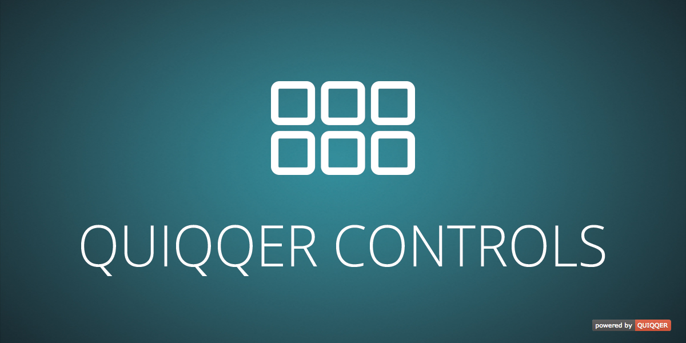

QUIQQER Controls
========

This repository offers some standard controls for developers in addition to the bricks.  
So developing is faster and you don't have to reinvent the wheel all the time.

Package name:

    quiqqer/controls

Features
--------

- Main control class (QUI\Control)

Installation
------------

The package name is: quiqqer/controls

Contribute
----------

- Issue Tracker: https://dev.quiqqer.com/quiqqer/controls/issues
- Source Code: https://dev.quiqqer.com/quiqqer/controls/tree/master

Support
-------

If you found any flaws, have any wishes or suggestions you can send an email
to support@pcsg.de to inform us about your concerns.  

We will try to respond to your request and forward it to the responsible developer.

License
-------

- GPL-3.0+

Usage
-----

Usage instructions can be found in the [wiki](https://dev.quiqqer.com/quiqqer/controls/wikis/usage).